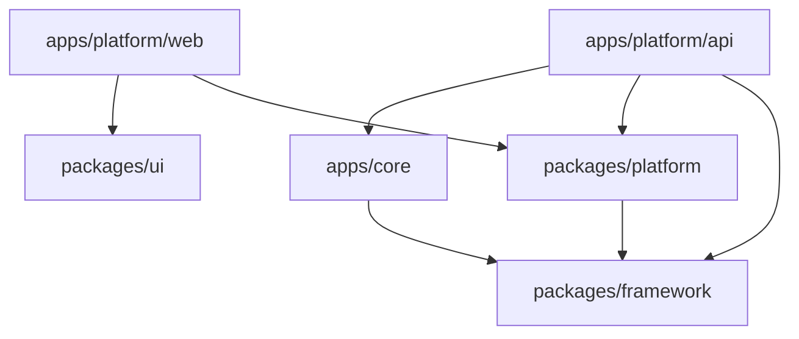

# Module Boundaries

## Module Definition

A CODEXSUN module is a business or platform capability with its own boundaries, contracts, configuration, and lifecycle.

Examples:

- Billing.
- Accounting.
- Inventory.
- Garments.
- uPVC.
- Offset Printing.
- POS.
- Mail.
- Tasks.
- WhatsApp Integration.
- Offline Sync.
- ZERO Assistant.

## Module Responsibilities

Each module should define:

- Purpose.
- Owned entities.
- Owned tables.
- Public APIs.
- Events published.
- Events consumed.
- Permissions.
- Feature flags.
- Tenant settings.
- Sync behavior.
- Reports.
- UI routes.
- Test scope.

## Standard Module Folder Structure

Modules should follow this structure:

```text
domain/
application/
infrastructure/
interface/
contracts/
events/
migrations/
tests/
```

This structure keeps business rules, use cases, adapters, public contracts, events, migrations, and tests separated in a predictable way.

## Module Contract

Every module should have an explicit contract.

The contract should answer:

- What can other modules ask this module to do?
- What data can other modules read?
- What events does this module publish?
- What events does this module listen to?
- What configuration does this module require?
- What happens when this module is disabled?

## Plug-And-Play Behavior

Modules should support activation and deactivation through tenant configuration.

When a module is activated:

- Required permissions are registered.
- Routes become available.
- Menus become visible.
- Background jobs are scheduled if needed.
- Settings are initialized.
- Required migrations are applied.

When a module is deactivated:

- New actions are blocked.
- Existing records remain available if required by compliance.
- Scheduled jobs stop where safe.
- Reports handle historical data correctly.

## Shared Kernel

Only very stable concepts should enter the shared kernel.

Possible shared concepts:

- Tenant ID.
- User ID.
- Money.
- Date range.
- Address.
- Tax identifier.
- Document number.
- Audit metadata.

Do not put unstable business rules in the shared kernel.

---

## Boundary Review (Task 17 — June 2026)

### App Boundaries (Physical)

| App/Package | Role | Owns |
|---|---|---|
| `packages/framework` | Shared kernel | DB abstraction, HTTP helpers, errors, modules registry, health check, testing utilities |
| `packages/platform` | Platform services | Auth, tenants, audit, settings, permissions, roles, subscription (scaffold), users, catalog, notifications, files, activity, agents, templates, API client |
| `packages/ui` | Design system | React components, layouts, workspace patterns, blocks (sidemenu, tables, forms) |
| `apps/core` | Master/business modules | Common definitions, contacts, companies, and products with database-backed tenant records; work orders and generic core records remain temporary |
| `apps/platform/api` | API gateway + platform routes | Route registration, guard functions (session, tenant, feature, permission), migration runner, DB bootstrap |
| `apps/platform/web` | React SPA | SA desk, Admin desk, Tenant desk, design system pages, API client integration |

### Table Ownership

**Master Database (codexsun_master_db) — owned by `apps/platform/api`:**

| Table | Owner | Purpose |
|---|---|---|
| `super_admin_users` | platform.users | SA authentication |
| `staff_users` | platform.users | Staff authentication |
| `tenants` | platform.tenants | Tenant registry |
| `tenant_databases` | platform.tenants | Per-tenant database tracking |
| `tenant_domain_mappings` | platform.tenants | Custom domain binding |
| `audit_events` | platform.audit | All audit records |
| `sessions` | platform.auth | Session store |
| `platform_modules` | platform.catalog | Module registry |
| `tenant_module_activation` | platform.catalog | Per-tenant module state |
| `platform_settings` | platform.settings | Key-value settings store |
| `platform_feature_flags` | platform.settings | Feature toggles |
| `file_metadata` | platform.files | File registry |
| `notification_records` | platform.notifications | Notification queue |
| `agent_action_audits` | platform.agents | Agent execution log |
| `activity_timeline` | platform.activity | Business activity feed |
| `comments` | platform.activity | Record-level comments |

**Tenant Databases — owned by tenant apps (future):**
| Table | Owner | Purpose |
|---|---|---|
| `tenant_users` | Platform (bootstrap) | Tenant user auth |
| `tenant_audit_events` | Platform (bootstrap) | Tenant-scoped audit |

### Package Dependency Direction



Key rule: `packages/platform` depends on `packages/framework` **only**. `apps/core` depends on `packages/framework` **only**. Platform API is the sole integration point where `platform` and `core` are combined.

### Migration Verification

- **001_master_foundation**: Creates tenant, SA, staff, database tables. ✓ Applied.
- **002_master_audit_sessions**: Creates audit_events, sessions. ✓ Applied.
- **003_master_platform_catalog**: Creates platform_modules, tenant_module_activation. ✓ Applied.
- **004_master_settings_files_notifications**: Creates settings, features, files, notifications, agents, activity, comments. ✓ Applied.
- **Bootstrap tenant migration**: Creates tenant_users, tenant_audit_events inline. ✓ Applied.

All 5 migration units pass initialization and run cleanly. Migration runner tracks state in `platform_migrations` table.

### Task 14 Artifact Cleanup

| Artifact | Action | Status |
|---|---|---|
| `packages/platform/src/master-data/` | Removed (entire dir) | ✓ Done |
| `apps/platform/api/src/master-data/routes.ts` | Removed | ✓ Done |
| `apps/platform/api/src/__tests__/master-data.test.ts` | Removed (replaced by core-routes.test.ts) | ✓ Done |
| `packages/platform/src/index.ts` — master-data export | Removed | ✓ Done |
| `apps/platform/api/src/app.ts` — master-data imports/services/decorations/routes | Removed | ✓ Done |
| `packages/platform/src/catalog/contracts.ts` — `business.master-data` entry | Removed | ✓ Done |
| `packages/platform/src/permissions/contracts.ts` — `business.master-data.*` permissions | Removed | ✓ Done |
| `apps/platform/web/src/pages/TenantDesk.tsx` — master-data nav items | Removed | ✓ Done |
| `apps/platform/web/src/pages/tenant/MasterDataPage.tsx` | Retained (read-only reference, no route dependency) | Retained |
| `apps/platform/web/src/pages/tenant/MasterRecordsPage.tsx` | Retained (read-only reference, no route dependency) | Retained |

### Module Catalog (Updated)

Current registered modules in `platformModuleCatalog`:

| Module Key | Scope | Status |
|---|---|---|
| `platform.tenants` | platform | Active |
| `platform.users` | platform | Active |
| `platform.roles` | platform | Active |
| `platform.permissions` | platform | Active |
| `platform.activation` | platform | Active |
| `platform.audit` | platform | Active |
| `platform.settings` | platform | Active |
| `platform.notifications` | platform | Active |
| `core` | tenant | Active (common definitions) |
| `core.contact` | tenant | Active |
| `core.company` | tenant | Active |
| `core.product` | tenant | Active |
| `business.items` | tenant | Future |
| `business.billing` | tenant | Future |
| `business.accounting` | tenant | Future |
| `business.reports` | tenant | Future |
| `business.offline-sync` | tenant | Future |

### Boundary Decisions

1. **Core owns master data** — All common definitions, contacts, companies, and products live in `apps/core`. Platform no longer has master-data routes.
2. **Platform owns platform operations** — Tenants, users, audit, settings, auth remain in `packages/platform` + `apps/platform/api`.
3. **API gateway is the integration point** — `apps/platform/api/src/app.ts` wires together platform services and core services. Core routes get `/core/*` prefix.
4. **Database-backed master records are required** — Common records, contacts, companies, and products are persisted in the master database with tenant scoping. Remaining temporary in-memory modules must not be promoted to production until they have explicit tables and bootstrap repair.
5. **No direct core-to-platform dependency** — Core only depends on `packages/framework`. Platform guards are injected via `CoreRouteContext` at API registration time.
6. **Subscription is scaffold-only** — The `SubscriptionService` class exists but has no real implementation. Full billing integration is deferred.
7. **Industry scoping is defined but not implemented** — `ModuleScope` includes `"industry"` but no industry modules or tables exist yet.
8. **GST/ZETRO are placeholders** — Tax identity types and HSN codes exist in core contracts; full compliance APIs and ZETRO assistant are future work.
