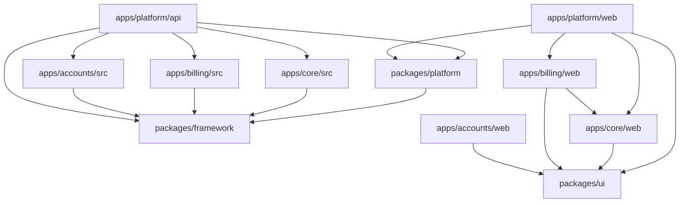

# Module Boundaries

## Module Definition

A CODEXSUN module is a business or platform capability with its own boundaries, contracts, configuration, and lifecycle.

Examples:

- Billing.
- Accounting.
- Inventory.
- Garments.
- uPVC.
- Offset Printing.
- POS.
- Mail.
- Tasks.
- WhatsApp Integration.
- Offline Sync.
- ZERO Assistant.

## Module Responsibilities

Each module should define:

- Purpose.
- Owned entities.
- Owned tables.
- Public APIs.
- Events published.
- Events consumed.
- Permissions.
- Feature flags.
- Tenant settings.
- Sync behavior.
- Reports.
- UI routes.
- Test scope.

## Standard Module Folder Structure

Modules must use one module folder with NestJS-like filenames. Do not create many nested boundary folders inside a module.

```text
apps/{app}/src/modules/{module}/
  {module}.module.ts       # Module definition and registration
  {module}.service.ts      # Use cases and business operations
  {module}.repository.ts   # Database adapter and persistence implementation
  {module}.routes.ts       # HTTP/interface layer
  {module}.events.ts       # Event names, publishers, subscribers, and handlers
  {module}.migration.ts    # Module-specific database migrations
  {module}.worker.ts       # Queue registration and background job processors
  {module}.seed.ts         # Default data and seed behavior
  {module}.sync.ts         # Offline and sync rules
  {module}.test.ts         # Module tests or test helpers
  {module}.types.ts        # Public types and contracts
  index.ts                 # Public exports
```

Example:

```text
apps/billing/src/modules/quotation/
  quotation.module.ts
  quotation.service.ts
  quotation.repository.ts
  quotation.routes.ts
  quotation.events.ts
  quotation.migration.ts
  quotation.worker.ts
  quotation.seed.ts
  quotation.sync.ts
  quotation.test.ts
  quotation.types.ts
  index.ts
```

This structure keeps module code easy to scan while preserving clear roles. It replaces folder-heavy patterns such as `application/index.ts`, `contracts/index.ts`, `domain/index.ts`, `infrastructure/index.ts`, and similar nested placeholders.

Module files should be created when the module needs that concern or when the module is being scaffolded as a planned full module. Do not create nested boundary folders for normal app modules.

Strict naming rules:

- Use the module name as the filename prefix, for example `quotation.service.ts`, not `service.ts`.
- Use singular role names: `migration.ts`, `worker.ts`, `seed.ts`, `sync.ts`, `test.ts`, `types.ts`.
- Keep public exports in `index.ts`.
- Keep queue registration and worker processors together in `{module}.worker.ts` unless the module becomes large enough to justify a later explicit split.
- Use `routes.ts` for HTTP/interface code. Do not use a vague `interface.ts` filename for routes.
- Use `types.ts` for public contracts and shared module types. Do not create a separate `contracts/` folder.

## Standard App Source Structure

Business apps must use `src/` for backend/module source and `web/` for frontend source.

```text
apps/
  platform/
    api/              # Runnable platform API gateway/composition surface
    web/              # Runnable platform shell and route composer

  core/
    src/              # Core backend modules
    web/              # Core frontend modules

  billing/
    src/              # Billing backend modules and thin package exports
    web/              # Billing frontend modules

  accounts/
    src/              # Accounts backend modules
    web/              # Accounts frontend modules

  ecommerce/
    src/              # Ecommerce backend modules
    web/              # Ecommerce frontend modules

  crm/
    src/              # CRM backend modules
    web/              # CRM frontend modules

  sites/
    src/              # Sites backend modules
    web/              # Sites frontend modules
```

Use `src`, not `api`, for business app backend code because a business app owns more than HTTP routes: domain rules, application use cases, contracts, infrastructure, migrations, events, queues, workers, sync behavior, tests, and interface adapters all live under the app backend source.

Use `api` only for a runnable API process such as `apps/platform/api`, where the responsibility is gateway/composition, auth, tenant context, RBAC, app registry, route registration, database bootstrap, and shared runtime wiring.

Business app `src/` roots must remain flat:

```text
apps/{app}/src/
  index.ts
  modules/
```

Routes, migrations, workers, seeders, sync rules, contracts, repositories, and use cases must live under `src/modules/{module}/` using the module-prefixed filenames above. Package subpaths may point at module exports for compatibility, but source folders such as top-level `api/`, `migrations/`, `queues/`, `seeders/`, `sync/`, and `workers/` should not be recreated.

Frontend ownership follows the same boundary:

- `apps/platform/web` owns the shell, login, SA/admin desks, tenant desk layout, global navigation, activation, and route composition.
- `apps/core/web` owns common/master tenant screens and shared tenant data UI.
- `apps/billing/web` owns billing entries, billing settings, billing reports, and billing forms.
- `apps/accounts/web`, `apps/ecommerce/web`, `apps/crm/web`, and `apps/sites/web` own their own app-specific screens and routes.
- `packages/ui` owns reusable design-system primitives only. It must not absorb app-specific business screens or rules.

Business app web packages must use `web/pages/modules/{module}/` for app-owned frontend workflows:

```text
apps/{app}/web/pages/
  api.ts
  index.ts
  modules/
    {module}/
      index.ts
      {module}.list.tsx
      {module}.form.tsx
      {module}.workspace.tsx
      {module}.services.ts
      {module}.hooks.ts
      {module}.types.ts
      {module}.schema.ts
      {module}.spec.ts
      {module}.settings.tsx
      {module}.print.tsx
apps/{app}/web/shared/
  index.ts
  {shared-area}/
    index.ts
```

Shared controls and layout primitives belong in `packages/ui`. Cross-module app-web code belongs in `web/shared`. Business-specific page state, forms, lists, document settings, print UI, and workflow composition stay in the owning app web module under `web/pages/modules/{module}`. Do not recreate `features/`, `pages/tenant`, or first-level module folders such as `web/pages/sales`.

Within a frontend module, API calls go in `{module}.services.ts`, custom hooks go in `{module}.hooks.ts`, Zod schemas go in `{module}.schema.ts`, interfaces/types go in `{module}.types.ts`, and focused Playwright tests go in `{module}.spec.ts`. Billing web modules share `web/playwright.config.ts`; per-module Playwright config files are not allowed. Page components should consume those files instead of calling shared APIs directly when the behavior belongs to that module.

## Module Contract

Every module should have an explicit contract.

The contract should answer:

- What can other modules ask this module to do?
- What data can other modules read?
- What events does this module publish?
- What events does this module listen to?
- What configuration does this module require?
- What happens when this module is disabled?

## Plug-And-Play Behavior

Modules should support activation and deactivation through tenant configuration.

Tenant and industry activation must stay explicit. A module may be platform-scoped, tenant-scoped, industry-scoped, or integration-scoped, but tenant runtime access must still pass tenant context, active tenant checks, feature/module activation checks, permission checks, and tenant-owned data access.

When a module is activated:

- Required permissions are registered.
- Routes become available.
- Menus become visible.
- Background jobs are scheduled if needed.
- Settings are initialized.
- Required migrations are applied.

When a module is deactivated:

- New actions are blocked.
- Existing records remain available if required by compliance.
- Scheduled jobs stop where safe.
- Reports handle historical data correctly.

## Shared Kernel

Only very stable concepts should enter the shared kernel.

Possible shared concepts:

- Tenant ID.
- User ID.
- Money.
- Date range.
- Address.
- Tax identifier.
- Document number.
- Audit metadata.

Do not put unstable business rules in the shared kernel.

---

## Boundary Review (Task 17 — June 2026)

### App Boundaries (Physical)

| App/Package | Role | Owns |
|---|---|---|
| `packages/framework` | Shared kernel | DB abstraction, HTTP helpers, errors, modules registry, health check, testing utilities |
| `packages/platform` | Platform services | Auth, tenants, audit, settings, permissions, roles, subscription (scaffold), users, catalog, notifications, files, activity, agents, templates, API client |
| `packages/ui` | Design system | React components, layouts, workspace patterns, blocks (sidemenu, tables, forms) |
| `apps/core/src` | Master/business backend modules | Common definitions, contacts, companies, and products with database-backed tenant records; work orders and generic core records remain temporary |
| `apps/core/web` | Core frontend modules | Common/master tenant screens, lookup controls, and reusable tenant record workspace UI |
| `apps/billing/src` | Billing backend modules | Quotation, sales, export sales, purchase, receipt, payment contracts, routes, migrations, workers, seeders, and sync rules under module folders |
| `apps/billing/web` | Billing frontend modules | Billing entry workspaces, billing settings, billing forms, and billing reports |
| `apps/accounts/src` | Accounting backend modules | Ledgers, bank accounts, cash accounts, journal, contra, double-entry contracts, posting contracts |
| `apps/accounts/web` | Accounting frontend modules | Accounts screens, reports, voucher UI, and app-specific account workspaces |
| `apps/platform/api` | API gateway + platform routes | Route registration, guard functions (session, tenant, feature, permission), migration runner, DB bootstrap |
| `apps/platform/web` | Platform shell and React composer | Login, SA desk, Admin desk, Tenant desk shell, design system pages, route/menu composition, API client integration |

### Table Ownership

**Master Database (codexsun_master_db) — owned by `apps/platform/api`:**

| Table | Owner | Purpose |
|---|---|---|
| `super_admin_users` | platform.users | SA authentication |
| `staff_users` | platform.users | Staff authentication |
| `tenants` | platform.tenants | Tenant registry |
| `tenant_databases` | platform.tenants | Per-tenant database tracking |
| `tenant_domain_mappings` | platform.tenants | Custom domain binding |
| `audit_events` | platform.audit | All audit records |
| `sessions` | platform.auth | Session store |
| `platform_modules` | platform.catalog | Module registry |
| `tenant_module_activation` | platform.catalog | Per-tenant module state |
| `platform_settings` | platform.settings | Key-value settings store |
| `platform_feature_flags` | platform.settings | Feature toggles |
| `file_metadata` | platform.files | File registry |
| `notification_records` | platform.notifications | Notification queue |
| `agent_action_audits` | platform.agents | Agent execution log |
| `activity_timeline` | platform.activity | Business activity feed |
| `comments` | platform.activity | Record-level comments |

**Tenant Databases — owned by tenant apps (future):**
| Table | Owner | Purpose |
|---|---|---|
| `tenant_users` | Platform (bootstrap) | Tenant user auth |
| `tenant_audit_events` | Platform (bootstrap) | Tenant-scoped audit |

### Package Dependency Direction



Key rule: `packages/platform` depends on `packages/framework` **only**. `apps/core` depends on `packages/framework` **only**. `apps/billing` owns entries and consumes core through injected contracts/UI composition, not direct platform code. `apps/accounts` owns accounting vouchers, ledgers, and posting contracts. Platform API is the integration point where `platform`, `core`, `billing`, and future apps are composed.

### App Suite Bundles

| Bundle | Includes | Purpose |
|---|---|---|
| Base SaaS | shared packages + `framework` + `platform` + `core` | Tenant, identity, RBAC, common modules, contacts, products, work orders |
| Billing Software | shared packages + `framework` + `platform` + `core` + `billing` + `accounts` | Entry billing with industry feature flags, document settings, and optional accounting integration |
| Ecommerce Suite | shared packages + `framework` + `platform` + `core` + `billing` + `ecommerce` | Ecommerce app consuming core masters and billing documents |
| CRM Suite | shared packages + `framework` + `platform` + `core` + `crm` | CRM app with shared identity, tenant, and core customer data foundation |
| Sites Suite | shared packages + `framework` + `platform` + `sites` | Sites app with platform identity, settings, files, and site-specific publishing tools |

Billing industry fields must stay as billing settings/features. Examples: offset billing uses PO/DC, garments uses colour/size, uPVC can add length/width/area later. Shared billing fields remain particulars, quantity, price, GST, subtotal, totals, and document controls.

### Migration Verification

- **001_master_foundation**: Creates tenant, SA, staff, database tables. ✓ Applied.
- **002_master_audit_sessions**: Creates audit_events, sessions. ✓ Applied.
- **003_master_platform_catalog**: Creates platform_modules, tenant_module_activation. ✓ Applied.
- **004_master_settings_files_notifications**: Creates settings, features, files, notifications, agents, activity, comments. ✓ Applied.
- **Bootstrap tenant migration**: Creates tenant_users, tenant_audit_events inline. ✓ Applied.

All 5 migration units pass initialization and run cleanly. Migration runner tracks state in `platform_migrations` table.

### Task 14 Artifact Cleanup

| Artifact | Action | Status |
|---|---|---|
| `packages/platform/src/master-data/` | Removed (entire dir) | ✓ Done |
| `apps/platform/api/src/master-data/routes.ts` | Removed | ✓ Done |
| `apps/platform/api/src/__tests__/master-data.test.ts` | Removed (replaced by core-routes.test.ts) | ✓ Done |
| `packages/platform/src/index.ts` — master-data export | Removed | ✓ Done |
| `apps/platform/api/src/app.ts` — master-data imports/services/decorations/routes | Removed | ✓ Done |
| `packages/platform/src/catalog/contracts.ts` — `business.master-data` entry | Removed | ✓ Done |
| `packages/platform/src/permissions/contracts.ts` — `business.master-data.*` permissions | Removed | ✓ Done |
| `apps/platform/web/src/pages/TenantDesk.tsx` — master-data nav items | Removed | ✓ Done |
| `apps/platform/web/src/pages/tenant/MasterDataPage.tsx` | Retained (read-only reference, no route dependency) | Retained |
| `apps/platform/web/src/pages/tenant/MasterRecordsPage.tsx` | Retained (read-only reference, no route dependency) | Retained |

### Module Catalog (Updated)

Current registered modules in `platformModuleCatalog`:

| Module Key | Scope | Status |
|---|---|---|
| `platform.tenants` | platform | Active |
| `platform.users` | platform | Active |
| `platform.roles` | platform | Active |
| `platform.permissions` | platform | Active |
| `platform.activation` | platform | Active |
| `platform.audit` | platform | Active |
| `platform.settings` | platform | Active |
| `platform.notifications` | platform | Active |
| `core` | tenant | Active (common definitions) |
| `core.contact` | tenant | Active |
| `core.company` | tenant | Active |
| `core.product` | tenant | Active |
| `business.items` | tenant | Future |
| `business.billing` | tenant | Active (entry modules) |
| `business.accounting` | tenant | Planned (`apps/accounts`) |
| `business.reports` | tenant | Future |
| `business.offline-sync` | tenant | Future |
| `app.zetro` | tenant | Future |
| `app.mail` | tenant | Future |
| `app.blog` | tenant | Future |
| `app.sites` | tenant | Future |

### Boundary Decisions

1. **Core owns master data** — All common definitions, contacts, companies, and products live in `apps/core`. Platform no longer has master-data routes.
2. **Platform owns platform operations** — Tenants, users, audit, settings, auth remain in `packages/platform` + `apps/platform/api`.
3. **API gateway is the integration point** — `apps/platform/api/src/app.ts` wires together platform, core, billing, and future app services. Core routes get `/core/*`; billing routes get `/billing/*` with temporary `/core/entries/*` compatibility.
4. **Database-backed master records are required** — Common records, contacts, companies, and products are persisted in the master database with tenant scoping. Remaining temporary in-memory modules must not be promoted to production until they have explicit tables and bootstrap repair.
5. **No direct core-to-platform dependency** — Core only depends on `packages/framework`. Platform guards are injected via `CoreRouteContext` at API registration time.
6. **Subscription is scaffold-only** — The `SubscriptionService` class exists but has no real implementation. Paid-plan enforcement is deferred.
7. **Industry scoping is defined but not implemented** — `ModuleScope` includes `"industry"` but no industry modules or tables exist yet.
8. **GST/ZETRO are placeholders** — Tax identity types and HSN codes exist in core contracts; full compliance APIs and ZETRO assistant are future work.

9. **Business apps use strict backend/frontend module folders** - Business apps such as Core, Billing, Accounts, Ecommerce, CRM, and Sites use `src/index.ts` plus `src/modules/` for backend modules and `web/pages/index.ts` plus `web/pages/modules/` for frontend modules. Only runnable gateway surfaces such as `apps/platform/api` use `api/`.
10. **Platform web composes app web packages** - `apps/platform/web` remains the shell and route/menu composer. Business screens must live in the owning app web package and be imported or registered through app manifests.

### Tenant Readiness Tracking

`assist/architecture/tenant-readiness-track.md` is the source of truth for current multi-tenant, multi-database, multi-industry, and multi-company readiness. Update it whenever tenancy enforcement moves forward or a new blocker appears.
